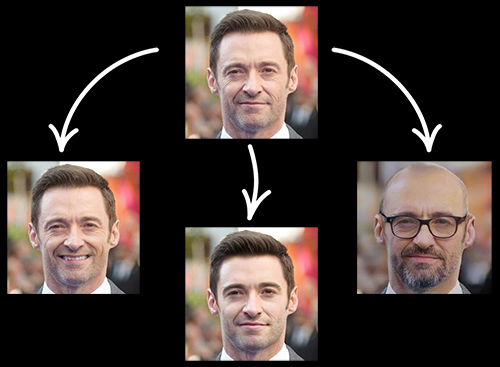

# FaceApp PHP API

Transform your face using Artificial Intelligence with PHP [FaceApp](http://faceapp.com) API
FaceApp is an [Android](https://play.google.com/store/apps/details?id=io.faceapp) and [iOS](https://itunes.apple.com/app/id1180884341) application.
This library is an unofficial wrapper to their AI system.




## Requirements

* PHP >= 5.6
* cURL/PHP

## Basic usage

```php
<?php

require('faceapp.php');

$FaceApp = new FaceApp('face.jpg');

$photoCode = $FaceApp->getPhotoCode();

//to get all available filters use : $FaceApp->getFilters();

$filter = 'old';

$FaceApp->applyFilter($photoCode,$filter,false);

if($FaceApp->savePhoto('newImagee.jpg')){
    echo "Done!";
}
```

## Methods

```php
$FaceApp = new FaceApp('PHOTO_PATH');
```

### getPhotoCode
Get the 'photo unique id' that has Been uploaded to faceapp servers
```php
$photoCode = $FaceApp->getPhotoCode();
```

### getFilters
Get all filters are available to apply the photo
```php
$photoCode = $FaceApp->getFilters(); //returns an array of filters

/*filters : 
	-no-filter
	-smile
	-smile_2
	-hot
	-old
	-young
	-hollywood
	-fun_glasses
	-hitman
	-mustache_free
	-pan
	-heisenberg
	-female
	-female_2
	-male
	-no-filter
	-impression
	-goatee
	-mustache
	-hipster
	-lion
	-bangs
	-glasses
	-wave
	-makeup
*/
```

### applyFilter
Get the code of photo has Been uploaded to faceapp servers
```php
$FaceApp->applyFilter(PHOTO_CODE , SELECTED_FILTER , CROP_FACE_OR_NOT);

//example :
//PHOTO_CODE(string) : $photoCode
//SELECTED_FILTER(string) : 'old'
//CROP_FACE_OR_NOT(bool) : true or false
```

### savePhoto
Save the final filtered photo
```php
$FaceApp->savePhoto('NEW_PHOTO_PATH.jpg');
```

## License

`Faceapp PHP API` is licensed under the MIT License - see the LICENSE file for details

## Description

Of course it is not a perfect and optimized project but u can develop it easily and improve it even better than me 😄❤

if there is any question or problem contact me in Telegram [@SubString](http://t.me/SubString) report it in issues.
Enjoy!

[FeeltheCode.com](http://FeeltheCode.com)
